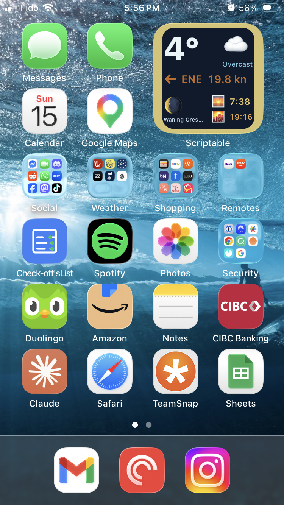

# Lake Weather Widget

A Scriptable medium widget showing at-a-glance conditions for outdoor and on-the-water activities.

**Displays:**
- Temperature with colour coding (cool → warm → hot, and the reverse for cold)
- Wind direction arrow, compass bearing, and speed in knots — colour coded by intensity
- Current condition (description + emoji)
- Weather alert border — yellow / orange / red when an active alert exists for your location
- Moon phase (icon + name)
- Sunrise and sunset times

---

## Requirements

- [Scriptable](https://scriptable.app) (free, App Store)
- A free [WeatherAPI.com](https://www.weatherapi.com) account for weather alerts
  - The free tier is sufficient — it covers 1 million calls/month

---

## Setup

### 1. Get a WeatherAPI.com key

Sign up at [weatherapi.com](https://www.weatherapi.com) and copy your API key from the dashboard.

### 2. Add the script to Scriptable

Copy `LakeWeather.js` into the Scriptable scripts folder, either via:
- **iCloud Drive** → Scriptable folder, or
- Paste the contents directly into a new script in the Scriptable app

### 3. Enter your API key

**Run the script once inside the Scriptable app** (tap the play button). You will be prompted to paste your WeatherAPI.com key. It is saved to the iOS Keychain — it never lives in the script file and won't be accidentally shared.

You only need to do this once. The key persists across updates.

### 4. Add the widget to your home screen

- Long-press the home screen → tap **+**
- Search for **Scriptable**
- Choose the **Medium** size
- Tap the widget → **Edit Widget**
- Set **Script** to `LakeWeather`
- Set **When Interacting** to **Run Script** (so tapping an alert banner opens the alert URL)

---

## Colour coding

### Temperature

| Condition | Colour |
|-----------|--------|
| Normal | White |
| ≥ 25 °C / ≤ −15 °C | Yellow |
| ≥ 30 °C / ≤ −20 °C | Orange |
| ≥ 35 °C / ≤ −25 °C | Red |
| ≥ 40 °C / ≤ −30 °C | White on red block |

### Wind speed

| Speed | Colour |
|-------|--------|
| < 10 kn | White |
| ≥ 10 kn | Yellow |
| ≥ 15 kn | Orange |
| ≥ 20 kn | Red |
| ≥ 25 kn | White on red block |

### Alert border

The widget border lights up when WeatherAPI reports an active alert for your GPS location:

| Severity | Border colour |
|----------|---------------|
| None | Invisible (matches background) |
| Minor | Yellow |
| Moderate | Orange |
| Severe / Extreme | Red |

Tapping the widget when an alert is active opens the alert details in Safari.

---

## Data sources

| Data | Source | Coverage |
|------|--------|----------|
| Temperature, wind, conditions | [Open-Meteo](https://open-meteo.com) | Global |
| Weather alerts | [WeatherAPI.com](https://www.weatherapi.com) | Canada, USA, most of Europe, Australia/NZ — patchy elsewhere |

Weather data works worldwide. Alert coverage is best in North America and Europe; in unsupported regions the border simply stays invisible.

---

## Refreshes

The widget refreshes every 15 minutes. Scriptable and iOS may delay this depending on battery and background app refresh settings.
